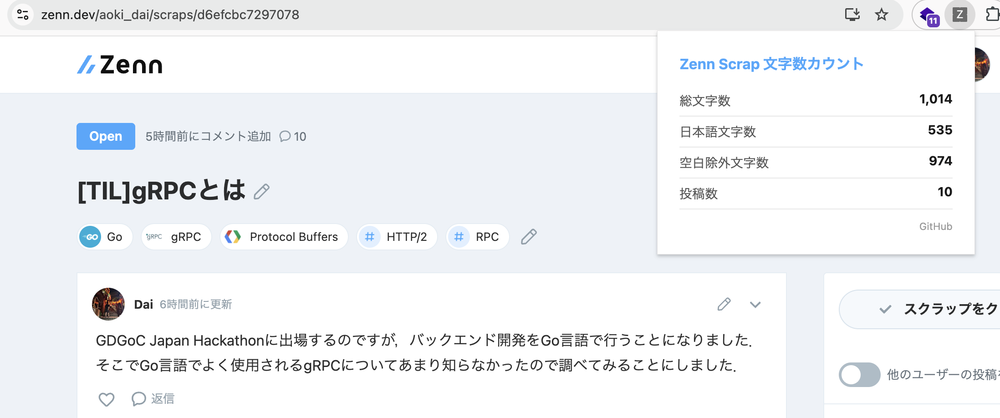

# Zenn Scrap Character Counter

Zenn のスクラップの文字数をカウントする Chrome 拡張機能です。  GoをWebAssemblyにコンパイルし、日本語文字を集計します。



## 機能

| 項目 | 内容 |
| --- | --- |
| 総文字数 | スクラップ全投稿の Unicode 文字単位の文字数 |
| 日本語文字数 | ひらがな・カタカナ・漢字の合計 |
| 空白除外文字数 | 空白・改行を除いた文字数 |
| 投稿数 | スクラップ内の投稿件数 |

## ディレクトリ構成

```txt
zenn-scrap-character-counter/
├── go/
│   ├── go.mod       # Go モジュール定義
│   └── main.go      # 文字数解析ロジック（Go → Wasm）
├── manifest.json    # Chrome 拡張機能設定（Manifest V3）
├── popup.html       # ポップアップ UI
├── popup.js         # Wasm 読み込み・結果表示
├── content.js       # Zenn ページからテキストを抽出
└── build.sh         # Go を Wasm にコンパイルするビルドスクリプト
```

`main.wasm` と `wasm_exec.js` は `build.sh` で生成されるため Git 管理外

## 必要な環境

- Go 1.26 以上
- Google Chrome(Dia動作確認済み)

## ビルド方法

```bash
git clone https://github.com/Aoki-Dai/zenn-scrap-character-counter.git
cd zenn-scrap-character-counter
bash build.sh
```

`build.sh` を実行すると以下のファイルが生成されます。

- `main.wasm` — コンパイル済み Go コード
- `wasm_exec.js` — Go Wasm ランタイム（Go インストール先からコピー）

## Chrome へのインストール

1. `chrome://extensions` を開く
2. 右上の「デベロッパーモード(Developer mode)」をオンにする
3. 「パッケージ化されていない拡張機能を読み込む(Load unpacked)」をクリック
4. このリポジトリのディレクトリを選択する

## 使い方

1. Zenn のスクラップページ（`https://zenn.dev/{ユーザー名}/scraps/{スクラップID}`）を開く
2. ページをリロードする（初回インストール時のみ）
3. ブラウザ右上の拡張機能アイコンをクリック

## 仕組み

```txt
popup.js
  └─ WebAssembly.instantiate(main.wasm)   # Go コードをブラウザ上で実行
  └─ chrome.tabs.sendMessage              # content.js にテキスト取得を依頼
       └─ content.js                      # Zenn の DOM からテキストを抽出
  └─ analyzeText(text)                    # Go 関数を JS から直接呼び出し
```

Go 側では `[]rune(text)` で文字列を Unicode コードポイント単位に変換し、
`unicode.Is()` で日本語文字を判定しています。

## Privacy Policy

本拡張機能は、ユーザーのデータを一切収集・送信・保存しません。

- Zenn スクラップページのテキストはユーザーのブラウザ内でのみ処理されます
- 外部サーバーへのデータ送信は行いません
- クッキー・ローカルストレージへの書き込みは行いません
- 解析結果はポップアップ表示のみに使用され、保持されません
